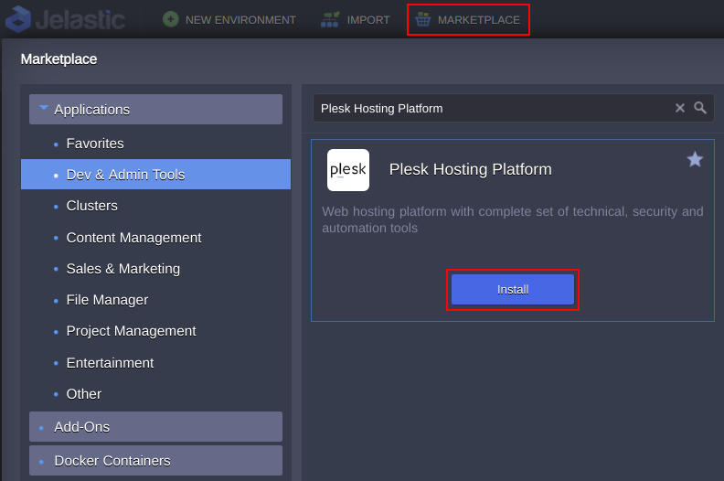
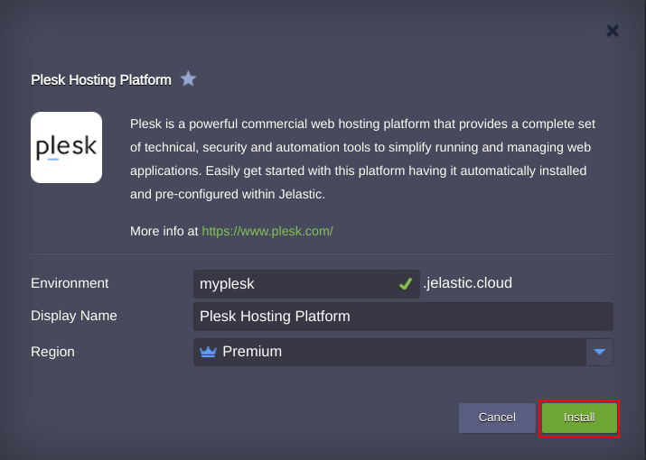
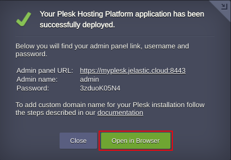

# Plesk Control Panel

Plesk is a powerful commercial WebOps hosting platform that allows you to easily manage and automate web-applications, sites, mailboxes and hosting business. User can customize the operation of online projects, email accounts, and DNS records, etc., using a web interface. Plesk control panel allows you to save a lot of time and effort, since an isolated environment will be created for all your clients, and they will be able to manage their projects independently.

## Plesk Deployment

Click the **Deploy** button below, specify your email address within the widget, choose one of the [Jelastic Public Cloud providers](https://jelastic.com/install-application/?manifest=https://raw.githubusercontent.com/jelastic-jps/plesk/master/manifest.jps) and press **Install**.

If you have already the account, you can import the link of the application manifest within Jelastic PaaS dashboard or initiate installation from **Marketplace > Dev & Admin Tools > Plesk Panel**

In the opened confirmation window type the Environment name, optionally customize its *Display Name*, select a preferable [Region](https://docs.jelastic.com/environment-regions) (if several are available) and click on **Install**.

Wait a few minutes for the process to be completed. Then press **Open in Browser** button to access *Plesk Control Panel*.

### Managed Hosting Business on Plesk Control Panel

Interested to build hosting business on scalable automated installation of Plesk Control Panel from Jelastic PaaS? [Contact our team to discuss the opportunity](https://jelastic.com/contact/)
